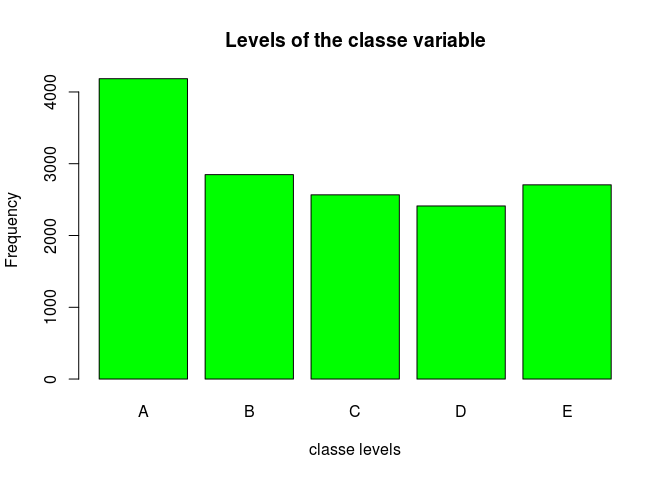
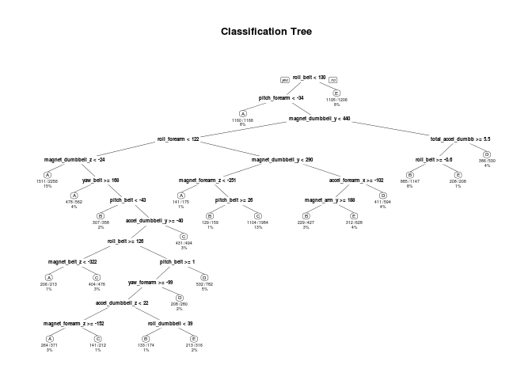

# Practical Machine Learning course assignment.
Ilshat Fattakhov  
22.03.2015  
#Building Predictive Model For Determining Fitness Exercise Correctness

##Abstract

Using devices such as Jawbone Up, Nike FuelBand, and Fitbit it is now possible to collect a large amount of data about personal activity relatively inexpensively. These type of devices are part of the quantified self movement – a group of enthusiasts who take measurements about themselves regularly to improve their health, to find patterns in their behavior, or because they are tech geeks. One thing that people regularly do is quantify how much of a particular activity they do, but they rarely quantify how well they do it. In this project, your goal will be to use data from accelerometers on the belt, forearm, arm, and dumbell of 6 participants. They were asked to perform barbell lifts correctly and incorrectly in 5 different ways.

The goal of this project is to predict the manner in which they did the exercise. This is the `classe` variable in the training set.

## Data description

The outcome variable is `classe`, a factor variable with 5 levels. For this data set, participants were asked to perform one set of 10 repetitions of the Unilateral Dumbbell Biceps Curl in 5 different fashions:

- exactly according to the specification (Class A)
- throwing the elbows to the front (Class B)
- lifting the dumbbell only halfway (Class C)
- lowering the dumbbell only halfway (Class D)
- throwing the hips to the front (Class E)

## Initial configuration

The initial configuration consists of loading some required packages and initializing some variables.


```r
#Data variables
training.file   <- './data/pml-training.csv'
test.cases.file <- './data/pml-testing.csv'
training.url    <- 'http://d396qusza40orc.cloudfront.net/predmachlearn/pml-training.csv'
test.cases.url  <- 'http://d396qusza40orc.cloudfront.net/predmachlearn/pml-testing.csv'

#Directories
if (!file.exists("data")){
  dir.create("data")
}
if (!file.exists("submission")){
  dir.create("submission")
}

#R-Packages
  library("caret")
```

```
## Loading required package: lattice
## Loading required package: ggplot2
```

```r
  library("randomForest")
```

```
## randomForest 4.6-10
## Type rfNews() to see new features/changes/bug fixes.
```

```r
  library("rpart")
  library("rpart.plot")

# Set seed for reproducability
set.seed(9999)
```

## Data processing
The data is taken from the [Human Activity Recognition](http://groupware.les.inf.puc-rio.br/har) programme at [Groupware](http://groupware.les.inf.puc-rio.br/).

In this section the data is downloaded and processed. Some basic transformations and cleanup will be performed, so that `NA` values are omitted. 

The `pml-training.csv` data is used to devise training and testing sets.
The `pml-test.csv` data is used to predict and answer the 20 questions based on the trained model.


```r
# Download data
if (!file.exists(training.file)){
  download.file(training.url, training.file)
}
if (!file.exists(test.cases.file)){
  download.file(test.cases.url,test.cases.file )
}

# Clean and subset data
training   <-read.csv(training.file, na.strings=c("NA","#DIV/0!", ""))
testing <-read.csv(test.cases.file , na.strings=c("NA", "#DIV/0!", ""))
training<-training[,colSums(is.na(training)) == 0]
testing <-testing[,colSums(is.na(testing)) == 0]

training   <-training[,-c(1:7)]
testing <-testing[,-c(1:7)]
```

## Cross-validation
In this section cross-validation will be performed by splitting the training data in training (75%) and testing (25%) data.


```r
subSamples <- createDataPartition(y=training$classe, p=0.75, list=FALSE)
subTraining <- training[subSamples, ] 
subTesting <- training[-subSamples, ]
```

## Expected out-of-sample error
The expected out-of-sample error will correspond to the quantity: 1-accuracy in the cross-validation data. Accuracy is the proportion of correct classified observation over the total sample in the subTesting data set. Expected accuracy is the expected accuracy in the out-of-sample data set (i.e. original testing data set). Thus, the expected value of the out-of-sample error will correspond to the expected number of missclassified observations/total observations in the Test data set, which is the quantity: 1-accuracy found from the cross-validation data set.

## Exploratory analysis
The variable `classe` contains 5 levels. The plot of the outcome variable shows the frequency of each levels in the subTraining data.


```r
plot(subTraining$classe, col="green", main="Levels of the classe variable", xlab="classe levels", ylab="Frequency")
```

 

As we can see, level A is the most frequent classe. D appears to be the least frequent one.

## Prediction models
In this section we apply a decision tree and random forest models to the data.
 

### Decision tree

```r
# Fit model
modelFitDesTree <- rpart(classe ~ ., data=subTraining, method="class")

# Perform prediction
predictDesTree <- predict(modelFitDesTree, subTesting, type = "class")

# Plot result
rpart.plot(modelFitDesTree, main="Classification Tree", extra=102, under=TRUE, faclen=0)
```

 

Following confusion matrix shows the errors of the prediction algorithm.


```r
confusionMatrix(predictDesTree, subTesting$classe)
```

```
## Confusion Matrix and Statistics
## 
##           Reference
## Prediction    A    B    C    D    E
##          A 1266  208   25   91   29
##          B   33  535   71   30   67
##          C   28   90  676  130   94
##          D   45   72   59  501   43
##          E   23   44   24   52  668
## 
## Overall Statistics
##                                          
##                Accuracy : 0.7435         
##                  95% CI : (0.731, 0.7557)
##     No Information Rate : 0.2845         
##     P-Value [Acc > NIR] : < 2.2e-16      
##                                          
##                   Kappa : 0.6738         
##  Mcnemar's Test P-Value : < 2.2e-16      
## 
## Statistics by Class:
## 
##                      Class: A Class: B Class: C Class: D Class: E
## Sensitivity            0.9075   0.5638   0.7906   0.6231   0.7414
## Specificity            0.8994   0.9492   0.9155   0.9466   0.9643
## Pos Pred Value         0.7820   0.7269   0.6640   0.6958   0.8237
## Neg Pred Value         0.9607   0.9007   0.9539   0.9276   0.9431
## Prevalence             0.2845   0.1935   0.1743   0.1639   0.1837
## Detection Rate         0.2582   0.1091   0.1378   0.1022   0.1362
## Detection Prevalence   0.3301   0.1501   0.2076   0.1468   0.1654
## Balanced Accuracy      0.9035   0.7565   0.8531   0.7849   0.8528
```

### Random forest

```r
# Fit model
modelFitRandForest <- randomForest(classe ~ ., data=subTraining, method="class")

# Perform prediction
predictRandForest <- predict(modelFitRandForest, subTesting, type = "class")
```

Following confusion matrix shows the errors of the prediction algorithm.


```r
confusionMatrix(predictRandForest, subTesting$classe)
```

```
## Confusion Matrix and Statistics
## 
##           Reference
## Prediction    A    B    C    D    E
##          A 1394    2    0    0    0
##          B    1  946    8    0    0
##          C    0    1  846    6    0
##          D    0    0    1  796    1
##          E    0    0    0    2  900
## 
## Overall Statistics
##                                           
##                Accuracy : 0.9955          
##                  95% CI : (0.9932, 0.9972)
##     No Information Rate : 0.2845          
##     P-Value [Acc > NIR] : < 2.2e-16       
##                                           
##                   Kappa : 0.9943          
##  Mcnemar's Test P-Value : NA              
## 
## Statistics by Class:
## 
##                      Class: A Class: B Class: C Class: D Class: E
## Sensitivity            0.9993   0.9968   0.9895   0.9900   0.9989
## Specificity            0.9994   0.9977   0.9983   0.9995   0.9995
## Pos Pred Value         0.9986   0.9906   0.9918   0.9975   0.9978
## Neg Pred Value         0.9997   0.9992   0.9978   0.9981   0.9998
## Prevalence             0.2845   0.1935   0.1743   0.1639   0.1837
## Detection Rate         0.2843   0.1929   0.1725   0.1623   0.1835
## Detection Prevalence   0.2847   0.1947   0.1739   0.1627   0.1839
## Balanced Accuracy      0.9994   0.9973   0.9939   0.9948   0.9992
```

## Conclusion

### Result

The confusion matrices show, that the Random Forest algorithm performens better than decision trees. The accuracy for the Random Forest model was 0.995 (95% CI: (0.993, 0.997)) compared to 0.7435 (95% CI: (0.731, 0.756)) for Decision Tree model. The random Forest model is choosen.

### Expected out-of-sample error
The expected out-of-sample error is estimated at 0.005, or 0.5%. The expected out-of-sample error is calculated as 1 - accuracy for predictions made against the cross-validation set. Our Test data set comprises 20 cases. With an accuracy above 99% on our cross-validation data, we can expect that very few, or none, of the test samples will be missclassified.

## Submission
In this section the files for the project submission are generated using the random forest algorithm on the testing data.


```r
# Perform prediction
predictSubmission <- predict(modelFitRandForest, testing, type="class")
predictSubmission
```

```
##  1  2  3  4  5  6  7  8  9 10 11 12 13 14 15 16 17 18 19 20 
##  B  A  B  A  A  E  D  B  A  A  B  C  B  A  E  E  A  B  B  B 
## Levels: A B C D E
```

```r
# Write files for submission
pml_write_files = function(x){
  n = length(x)
  for(i in 1:n){
    filename = paste0("./submission/problem_id_",i,".txt")
    write.table(x[i],file=filename,quote=FALSE,row.names=FALSE,col.names=FALSE)
  }
}

pml_write_files(predictSubmission)
```
